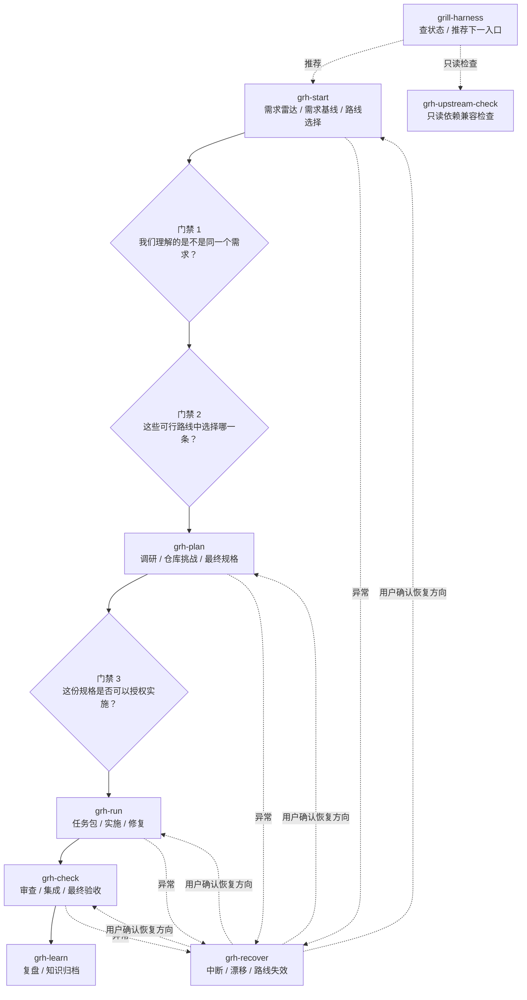

# Grill Harness

面向 Codex 与 Claude Code 的多入口、单内核、可恢复软件工程工作流 Skill。它按角色组织需求雷达、需求澄清、路线选择、仓库挑战、拆分、实施、审查、修复、集成、验收和知识归档；用户自行选择每个角色使用的模型或 Agent。

工作流事实来自本地文件和真实仓库，不依赖长对话记忆。仓库发布一个兜底 Router `grill-harness` 和七个薄入口；八个入口共享同一内核、状态机、脚本和产物契约。

## 30 秒理解

Grill Harness 不是让用户维护更多流程文档，而是把“事实、决策、授权和证据”分开管理，让复杂工作可以中断、换模型、换会话后继续。

- **Harness 负责**：识别项目与当前阶段，维护状态、门禁、产物版本和下一入口建议。
- **Agent 负责**：读取真实仓库，澄清需求、查证事实、形成方案、执行被授权的任务并提交证据。
- **用户负责**：确定目标与非目标，确认需求基线，选择路线，批准最终规格，选择各角色使用的模型或 Agent，并作最终验收决定。

用户不需要背下八个入口：不知道下一步时调用 `grill-harness`；已经明确要澄清、规划、实施、验收、恢复或复盘时，直接调用对应的 `grh-*` 入口。任何入口都不会替用户越过门禁或自动串联下一阶段。

## 安装

依赖 Node.js、`npx` 和只使用标准库的 Python 3。先安装必需能力：

```bash
npx skills add mattpocock/skills -g -a codex claude-code -s grilling domain-modeling codebase-design -y --copy
```

从本仓库根目录安装 Grill Harness：

```bash
npx skills add "$PWD" -g -a codex claude-code -s '*' -y --copy
```

以上依赖安装与八入口 `-s '*'` 本地仓库安装命令已由 `tests/integration/test_skills_install.sh` 在隔离 HOME 中实际验证。当前 `skills` CLI 会把 canonical 副本安装到 `~/.agents/skills/<入口>`，并为 Claude Code 建立 `~/.claude/skills/<入口>` 入口。

如果只安装了某个薄入口而缺少主内核，该入口会失败关闭，不创建运行时目录，并提示用上面的 `-s '*'` 命令完整安装；它不会猜测兄弟目录或静默复制内核。

安装只复制 Skill，不创建运行时目录。首次开始工作流时才创建 `~/.grill-harness/`。卸载 Skill 不删除用户工作流数据：

```bash
npx skills remove grill-harness grh-start grh-plan grh-run grh-check grh-recover grh-learn grh-upstream-check -g -a codex claude-code -y
```

## 八个公开入口

| 入口 | 控制意图 | 停止边界 |
|---|---|---|
| `grill-harness` | 查状态、获得下一步建议、路由自然语言请求 | 不直接执行完整阶段 |
| `grh-start` | 只读侦察、需求雷达、需求基线、路线比较 | 用户选择路线后停止 |
| `grh-plan` | 调研/原型、仓库挑战、最终规格、执行 Frontier | 最终规格等待批准；批准后生成 Frontier 并停止 |
| `grh-run` | 任务包、实施和经批准的修复循环 | 不做最终验收；路线失效转恢复 |
| `grh-check` | 只读审查、集成检查、最终验收 | 不实施或修复 |
| `grh-recover` | 中断、漂移、证据冲突、重复失败、路线失效 | 路线切换等待用户确认 |
| `grh-learn` | 查询经验、形成草稿、批准后归档 | 长期知识写入前等待用户确认 |
| `grh-upstream-check` | 检查依赖和上游兼容性 | 只读，不安装、不更新 |

标准公开流程是 `grh-start → grh-plan → grh-run → grh-check → grh-learn`。入口完成后只建议下一入口，不会自动串联。用户明确指定入口或更窄范围时尊重该意图；前置产物和门禁仍不可绕过。



图中的连线表示允许的协作方向，不表示自动执行。Router 只推荐入口，恢复入口只提出恢复方向；真正推进仍由用户显式调用入口或批准门禁。

## 三种使用深度

- **轻量模式**：低风险局部修改。缩短需求雷达、路线卡和规格，但三个门禁仍在对应产物形成后分别批准；仍保留真实测试/diff 和独立验收。
- **标准模式**：默认。经过需求基线、路线选择、仓库挑战、最终规格、垂直切片、独立审查和验收。
- **Wayfinding 模式**：巨大或方向模糊、单会话无法建立可信地图。先把调查与决策拆成独立新会话任务包，路线清楚后回到标准模式。

可以直接点名入口，也可以让 Router 推荐。例如：“用 `grh-start` 只确认需求，不进入路线选择”“用 `grh-check` 只做审查，不修复”。

## 需求雷达实际在问什么

需求雷达不是让用户理解 `RAD-xxx` 或填写工程术语，而是让 Agent 在需求基线前主动回答五个自然语言问题：

| 雷达维度 | 人真正需要知道的问题 | Agent 需要查证的内容 |
|---|---|---|
| 需求澄清 | 到底是谁，在什么条件下，要得到什么结果？ | 角色、触发条件、目标、边界和歧义 |
| 需求遗漏 | 正常路径之外，还有哪些情况必须处理？ | 异常、权限、空状态、兼容、迁移、回滚、运维和验收 |
| 需求牵连 | 改动会沿着哪些调用方、数据和系统边界传播？ | 调用方、状态、接口、事件、配置、部署和文档 |
| 需求悖论 | 目标、约束、成本、期限和验收是否互相冲突？ | 无法同时成立的要求、隐含取舍和阻塞条件 |
| 相似实现 | 仓库里是否已经有先例，哪些能复用、哪些不能？ | 真实路径与符号、差异、公共契约、可复用测试和历史踩坑 |

仓库、现有文档或工具能够回答的事实由 Agent 先查证，不把事实问题转嫁给用户。只有产品取舍、风险容忍、范围选择和无法安全推导的冲突才交给用户决定；稳定 ID 和机器状态保留在产物中用于追踪。

## 三个用户门禁

三个门禁不是重复询问“是否继续”，而是在三个不同层次取得明确授权：

| 门禁 | 用户真正回答的问题 | 防止的问题 | 通过后允许 |
|---|---|---|---|
| 需求基线确认 | “我们理解的是不是同一个需求？” | 带着错误目标、遗漏边界或未解决歧义比较方案 | 生成与比较路线 |
| 路线选择 | “这些可行路线中，我选择哪一条？” | Agent 默认替用户决定成本、范围和风险取舍 | 只深化被选中的路线 |
| 最终规格批准 | “这份实施合同是否足以授权写代码？” | 把草案、推荐或未验证假设当成实施授权 | 拆分任务并进入实施 |

最终规格批准前，产品仓库只读：不修改产品代码，不派发实施，不创建实施分支或 worktree。轻量模式也不能合并、预批或省略门禁，不能零确认编码。

每次批准都必须绑定已经形成的具体产物版本和真实用户决定。需求基线前维护 `需求雷达.md`、`问题与发现.yaml` 和 `相似实现对照.md`；需要独立调查时由用户选择调查 Agent，Harness 不替用户自动启动。

## 多模型与新会话协作

Grill Harness 为实施、审查、修复、集成和验收生成：

- `~/.grill-harness/` 内的自包含任务包；
- 一条简短的本地启动提示词；
- 约定的本地报告路径和证据格式。

用户决定把启动提示词交给哪个本地模型或 Agent。新会话读取任务包和真实仓库，不需要原聊天历史，也不提供 Web 便携提示词。实施者不能最终批准自己；并行结果必须集成检查；最终验收必须由新的独立会话执行。

## 文件与安全边界

所有 Harness 状态、文档、提示词和报告只写入：

```text
~/.grill-harness/
```

当前工作流按以下用途区分：

- `核心文档/`：需求基线、决策账本、领域词汇、当前规格、任务图；
- `过程产物/`：需求审问（含需求雷达和相似实现对照）、路线评估、研究与原型、仓库挑战、任务交接、实施报告、审查修复、学习草稿；
- `最终产物/`：最终规格、集成报告、验收报告、项目经验；
- `系统/`：状态、产物、任务、证据、失败 manifest 和追加式 review history 索引。

目标产品仓库不保存 Harness 状态或文档。预检和上游检查不会自动安装、更新或覆盖第三方 Skill；缺少必需能力时失败关闭。并行安全不明确时按不安全处理。

## 状态与恢复

```bash
GRH="$HOME/.agents/skills/grill-harness/scripts/grh.py"
python3 "$GRH" preflight --skill-root "$HOME/.agents/skills"
python3 "$GRH" init --project "$PWD" --workflow-name 发布检查 --created-date 2026-07-12
python3 "$GRH" status --project "$PWD"
python3 "$GRH" reconcile --workflow /绝对路径/工作流目录 --project "$PWD"
```

`preflight` 只检查能力并给出建议。`init` 原子、幂等地创建工作流，不覆盖已有用户数据。`status` 只读。`reconcile` 在文件冲突、手工编辑或中断恢复时列出矛盾，不替用户选择“最完整”的版本。

受保护的状态更新入口：

```bash
python3 "$GRH" record --workflow /绝对路径/工作流目录 --kind artifact --record /绝对路径/产物记录.yaml
python3 "$GRH" record --workflow /绝对路径/工作流目录 --kind evidence --record /绝对路径/证据记录.yaml --project "$PWD"
python3 "$GRH" approve --workflow /绝对路径/工作流目录 --gate final_spec_approval --approval-id DEC-003 --artifact-version ART-003=1
python3 "$GRH" transition --workflow /绝对路径/工作流目录 --phase tasking --to in_progress
python3 "$GRH" task-transition --workflow /绝对路径/工作流目录 --task TASK-001 --to in_progress --project "$PWD"
python3 "$GRH" task-review --workflow /绝对路径/工作流目录 --task TASK-001 --review /绝对路径/review.yaml --project "$PWD"
python3 "$GRH" failure-record --workflow /绝对路径/工作流目录 --project "$PWD" --failure-class implementation_failure --issue-id ISSUE-001 --failed-command 'pytest tests/x.py'
python3 "$GRH" migrate --workflow /绝对路径/工作流目录
python3 "$GRH" rollback --report /绝对路径/迁移报告.yaml
```

这些写命令只接受 `~/.grill-harness/` 内的工作流和输出路径，并同步机器清单；不要手工编辑系统文件后绕过 `reconcile`。

同一实现失败链的第三次尝试会阻断普通修复并要求 `grh-recover`。`route_failure` 等四类失败不会被混成同一路径；`task-review` 把结论追加到 `review_history`，阻塞项需独立复审，仅剩明确可选建议时才允许收敛。

测试可通过 `GRILL_HARNESS_TEST_ROOT` 把运行时根目录重定向到临时目录。

## 知识查询与两步归档

```bash
python3 "$GRH" knowledge-query --project "$PWD" --query "幂等"
python3 "$GRH" knowledge-draft --project "$PWD" --workflow /绝对路径/工作流目录 --record /绝对路径/KNW-001.yaml
python3 "$GRH" knowledge-promote --project "$PWD" --workflow /绝对路径/工作流目录 --record /绝对路径/KNW-001.yaml --scope project
python3 "$GRH" knowledge-promote --project "$PWD" --workflow /绝对路径/工作流目录 --preview /绝对路径/知识变更预览.yaml --scope project --approval-id DEC-900
```

`knowledge-query` 只读查询 `~/.grill-harness/知识库/项目知识/<项目ID>/knowledge.yaml` 和可选的 `知识库/通用知识/knowledge.yaml`。`knowledge-draft` 只在当前工作流的 `过程产物/学习草稿/` 写 tentative 草稿。`knowledge-promote` 先预览、再凭用户批准写项目知识；推广到通用知识还需项目归档完成和第二次独立批准。未被接受的验收会拒绝正式归档。

## 上游适配与更新

Grill Harness 实际组合 `grilling`、`domain-modeling`、`codebase-design`；`grill-with-docs` 仅作为兼容参考。上游检查会比较固定清单、路径、内容、行为契约、本地差异和兼容风险，但全程只读，不自动接受变化。

```bash
python3 "$GRH" upstream-check \
  --checked-at 2026-07-11T00:00:00Z
```

在线模式默认读取 Skill 自带的 `references/上游清单.yaml`，在临时目录只读 clone 上游并删除临时副本。离线比较已采集事实时增加 `--offline --facts /绝对路径/current-facts.json`；迁移旧清单时可显式传 `--previous`。报告固定声明 `actions_performed: false` 和 `accepted_upstream_changes: false`。网络失败只报告 unavailable；`grh-upstream-check` 不会安装或更新，任何更新动作必须由用户在入口外手动执行，之后再复查。

当前 CLI 顶层帮助列出 `npx skills update grill-harness -g`，但真实更新行为及本地目录安装的更新追踪尚未验证。不要把帮助检查当作更新验证；执行任何真实更新前先备份 `~/.grill-harness/`，运行兼容检查，并人工评估报告。

## 验证状态

已验证：仓库发现、隔离 Codex/Claude Code 安装、运行时目录隔离、只读 CLI、初始化幂等/冲突保护、卸载保留数据，以及 Python 单元与集成测试。

运行时行为未验证：真实 update 行为和已登录模型的端到端角色执行仍缺证据。隔离 Codex 返回 `401 Unauthorized`，隔离 Claude Code 返回 `Not logged in`，因此不声称模型行为或启动提示词已通过线上验证。

```bash
python3 -m unittest discover -s tests -p 'test_*.py'
tests/integration/test_skills_install.sh
tests/integration/test_runtime_data.sh
```

许可证：MIT，见 [LICENSE](LICENSE)。
