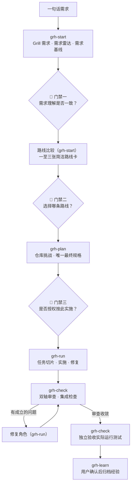

# Grill Harness

**人做决策，模型协作，高质量交付。**

Grill Harness 是一套角色驱动的软件工程工作流。你在关键节点拍板，不同能力侧重的模型按角色接力，每一次交接和结论都落在磁盘与证据上，而不是留在某一段聊天里。

```text
grh-start → grh-plan → grh-run → grh-check → grh-learn
 问透需求    收敛规格    切片实施    独立把关    沉淀经验
```

它的能力与纪律主要内化自 [mattpocock/skills](https://github.com/mattpocock/skills)，尤其是 Grill：先把需求问透，再让真实仓库挑战方案，最后用独立审查和真实测试证据收口。

---

## 30 秒理解

**它解决什么问题？** AI 做复杂需求时，最大的风险不是写不出代码，而是太早动手、交接丢约束、审查只信总结、没跑测试就说完成。Grill Harness 把这四类风险变成流程上的硬边界。

**为什么需要人参与决策？** “要什么、选哪条路、能否开工”没有客观答案。这三件事由你决定，AI 走到这三处必须停下来等你；仓库能查到的事实则由模型先查，不拿来消耗你。

**多模型如何协作？** 每个角色拿到一份磁盘上的自包含任务包：目标、授权范围、禁区、停止条件和验证命令齐备，不依赖聊天历史。你决定每个角色用哪个模型，换模型、换会话不丢事实。

**如何保障交付质量？** 需求雷达深挖遗漏，仓库调查用真实代码反驳方案，审查读完整 diff 而非实施者总结，验收实际运行测试。没有命令、退出码和输出，就不能宣布完成。

分工始终稳定：**Harness 负责**维护阶段、门禁、产物版本、任务包和恢复入口；**Agent 负责**读取真实仓库，只做当前角色被授权的工作并提交证据；**用户负责**确认需求、选择路线、批准规格、指定各角色模型，并作最终验收。

---

## 没有 Grill Harness / 有 Grill Harness

| 环节 | 没有 Grill Harness | 有 Grill Harness |
|---|---|---|
| 收到需求 | 模型快速理解后直接编码，隐含约束没被发现 | Grill 逐问目标、边界和失败语义，事实先查仓库 |
| 方案交接 | 方案被压缩成聊天摘要，越传越薄 | 需求、路线、规格落盘，角色读取自包含任务包 |
| 技术方案 | 建立在想象中的代码结构上 | 独立角色沿真实文件、符号和调用链反驳并补齐 |
| 实施 | 一个长会话包办所有角色，边界越做越糊 | 每个模型只完成一个有边界、可验证的任务切片 |
| 审查 | Reviewer 相信实施报告 | 规范与规格双轴检查完整代码、真实 diff 和证据 |
| 宣布完成 | 模型觉得“应该可以了” | 独立验收实际运行测试，凭退出码和输出下结论 |
| 中断或换模型 | 新会话靠旧聊天猜进度，决策逐渐失真 | 从磁盘状态、产物版本和证据原地恢复 |

> 不要求一个模型无所不能：人决定什么是对的，模型各做擅长的角色，证据把质量闭环。

---

## 🙋 人做决策 — 三个门禁，AI 不替你越过

人工确认固定在真正需要判断的三处。三个门禁不合并、不预批、不省略，轻量模式也一样；每次批准都绑定当时真实形成的产物版本。

| 门禁 | 你真正回答的问题 | 通过后才允许 |
|---|---|---|
| 需求基线确认 | 我们理解的是不是同一个需求？ | 比较可行路线 |
| 路线选择 | 这些可行路线中，我选择哪一条？ | 只深化被选中的路线 |
| 最终规格批准 | 这份实施合同是否足以授权写代码？ | 拆分任务并进入实施 |

最终规格批准之前，产品仓库保持只读：不修改代码、不派发实施，也不创建实施分支或 worktree。

Grill 一次只问一个需要你决定的问题，并附推荐答案；你的答复原文逐条存入用户确认记录。仓库、文档或工具能回答的事实由模型先查证，不伪装成用户选择。

---

## 🤝 模型协作 — 各展所长，不共享聊天历史

有的模型擅长业务分析，有的擅长读大仓库，有的执行稳定，有的审查敏锐。Grill Harness 不要求它们挤进同一段越来越长的上下文，而是隔着磁盘接力。

| 角色 | 主要责任 | 关键产物 |
|---|---|---|
| 主负责人 | Grill 需求、分析风险、比较路线 | 需求基线、路线卡 |
| 仓库调查 | 用真实代码挑战方案假设 | 仓库挑战报告 |
| 最终方案 | 综合需求、路线和调查结论 | 唯一最终规格 |
| 实施 | 按任务切片修改代码并运行测试 | 实施报告与证据 |
| 审查 | 对照规范、规格和真实 diff 找遗漏 | 结构化审查发现 |
| 修复 | 验证问题并作最小修复 | 修复与复审证据 |
| 独立验收 | 重新理解目标并实际运行检查 | 合并或发布结论 |

每份任务包写明输入版本、真实路径、授权范围、禁止范围、停止条件、验证命令和报告位置，完整契约见[角色任务协议](skills/grill-harness/references/角色任务协议.md)。

哪个模型演哪个角色由你决定。Harness 只生成任务包和短启动提示词，不自动选择或启动模型；一个入口完成后也只建议下一步，不自动串联下一阶段。

---

## ✅ 高质量交付 — “完成”必须经得起验证

质量不来自某个模型更自信的总结，而来自多层互相独立的校验：

1. **需求雷达**主动排查澄清、遗漏、牵连、悖论和相似实现五类风险；
2. **仓库挑战**用真实入口、调用方、数据、配置和测试反驳方案假设；
3. **唯一最终规格**收敛需求、决策、仓库事实、实施边界和验收标准；
4. **垂直任务切片**让每次实施都产生可独立验证的结果；
5. **双轴审查**分别核对代码规范与规格实现，一条轴不掩盖另一条；
6. **独立验收**检查完整 diff 与未提交文件，并实际运行可执行命令。

没有当前 Git 基线、真实命令、退出码和原始输出，任何角色都不能无条件宣布“完成”。

---

## 一句话需求如何走完全程

> 给订单提交增加幂等能力，避免重复创建订单。

直接交给一个模型，多半是在同步接口加个判断就收工，漏掉异步重试、并发竞争、幂等键生命周期和旧数据兼容。在 Grill Harness 里，它是一场有三次人工确认的接力：



图中连线只表示允许的推进方向。每个入口完成自己声明的范围就停止，由你决定继续、换模型、缩小范围，还是先离开。

| 接力棒 | 谁来做 | 发生了什么 |
|---|---|---|
| 问透需求（`grh-start`） | 你选的分析型模型 | 查清调用方、重复请求的定义、失败重试语义和回滚要求 |
| 🙋 门禁一 | 你 | 确认幂等范围、保留时间和冲突时的返回行为 |
| 路线比较（`grh-start`） | 同一角色 | 数据库唯一约束、幂等记录表、外部服务，各一张路线卡 |
| 🙋 门禁二 | 你 | 拍板一条路线；未选路线只存档，不再深化 |
| 仓库挑战（`grh-plan`） | 你选的长上下文模型 | 发现同步与异步重试共用创建逻辑，找到事务和测试切入点 |
| 最终规格（`grh-plan`） | 最终方案角色 | 数据模型、接口行为、错误语义、迁移和验收标准收敛为一份 |
| 🙋 门禁三 | 你 | 批准这份实施合同，产品仓库这才解除只读 |
| 切片实施（`grh-run`） | 你选的执行型模型 | 逐切片完成存储、同步路径、异步路径和测试，附命令证据 |
| 独立审查（`grh-check`） | 新会话的审查模型 | 对完整 diff 检查并发、超时、兼容性和非目标 |
| 独立验收（`grh-check`） | 又一个新会话 | 实际运行单元、集成和重复请求测试后给出交付结论 |
| 经验归档（`grh-learn`） | 经你确认 | 沉淀关键决策、踩坑和证据链接 |

每一棒读取的都是磁盘上的任务包和产物版本，而不是上一位的聊天记录。所以任何一棒都可以换成新模型、新会话，甚至隔几天再继续。

---

## 需求雷达实际在问什么

需求雷达不要求你理解工程分类，它把五类风险翻译成五个问题：

| 雷达维度 | 人真正需要知道的问题 | Agent 负责查证的内容 |
|---|---|---|
| 需求澄清 | 到底是谁，在什么条件下，要得到什么结果？ | 角色、触发条件、目标、边界和歧义 |
| 需求遗漏 | 正常路径之外，还有哪些情况必须处理？ | 异常、权限、空状态、兼容、迁移、回滚和验收 |
| 需求牵连 | 改动会沿哪些调用方、数据和系统边界传播？ | 接口、状态、事件、配置、部署和文档 |
| 需求悖论 | 目标、约束、成本、期限和验收能否同时成立？ | 隐含取舍、冲突和阻塞条件 |
| 相似实现 | 仓库里有哪些先例，哪些能复用、哪些必须隔离？ | 真实路径、公共契约、可复用测试和历史踩坑 |

只有产品取舍、风险容忍、范围决定和无法安全推导的冲突才交给你。每次问答原文和结果都进入当前工作流的用户确认记录。

---

## 简单任务轻着走，复杂任务走全程

简单任务不该承担和大型改造一样的文档重量，但质量边界不能因此消失。

| 模式 | 适用场景 | 处理方式 |
|---|---|---|
| **轻量模式** | 局部 Bug、配置或小范围修改 | 缩短雷达、路线卡和规格；保留三个门禁、真实测试、diff 检查和独立验收 |
| **标准模式** | 跨模块功能、有技术取舍的需求 | 完整使用需求基线、路线选择、仓库挑战、最终规格、任务切片、审查和验收 |
| **Wayfinding 模式** | 巨大、模糊、一个会话看不清的工作 | 先拆独立调查和决策任务，清除未知项后回到标准流程 |

### 什么时候不需要 Grill Harness

- 只解释一段代码，不产生交付改动；
- 做一次临时查询或无须保留的探索；
- 需求和边界都已明确，且你不需要完整的交付闭环。

---

## 八个入口：一条主线，三个辅助

你首先需要记住的是主线，而不是八个命令。不确定下一步时，调用 `grill-harness` 让它推荐。

```text
grh-start → grh-plan → grh-run → grh-check → grh-learn
```

| 主线入口 | 用户意图 | 停止边界 |
|---|---|---|
| `grh-start` | Grill 需求、需求基线、路线比较 | 用户选择路线后停止 |
| `grh-plan` | 研究/原型、仓库挑战、最终规格、任务拆分 | 最终规格等待批准；批准后生成任务图与可开工集合并停止 |
| `grh-run` | 任务包、实施和经批准的修复 | 不执行最终验收；路线失效转恢复 |
| `grh-check` | 独立审查、集成检查、最终验收 | 只依据真实仓库和证据给结论 |
| `grh-learn` | 查询经验、复盘和知识归档 | 长期知识写入前等待用户确认 |

| 辅助入口 | 用途 | 边界 |
|---|---|---|
| `grill-harness` | 查状态，不确定下一步时推荐入口 | 只做导航，不执行完整阶段 |
| `grh-recover` | 中断、漂移、冲突、重复失败或路线失效 | 改变路线前等待用户确认 |
| `grh-upstream-check` | 检查依赖与上游兼容性 | 只读，不安装、不更新 |

你明确指定入口或更窄范围时，Harness 尊重该意图；但前置产物和三个人工门禁在任何入口都不可绕过。

---

## 快速开始

依赖 Node.js、`npx` 和只使用标准库的 Python 3。

### 1. 安装底层必需能力

```bash
npx skills add mattpocock/skills -g -a codex claude-code -s grilling domain-modeling codebase-design -y --copy
```

必需能力只有这三项。`research`、`prototype`、`tdd`、`code-review`、`wayfinder`、`to-spec`、`to-tickets` 和 `implement` 都是可选增强：缺失时按[能力编排矩阵](skills/grill-harness/references/能力编排矩阵.md)降级为 Grill Harness 自己的协议与产物，不阻塞主流程，也不会被自动安装。

### 2. 从本仓库根目录安装全部入口

```bash
npx skills add "$PWD" -g -a codex claude-code -s '*' -y --copy
```

安装只复制 Skill，不创建运行时目录；首次开始工作流时才会创建 `~/.grill-harness/`。

如果只装了薄入口而缺少主内核，入口会失败关闭并给出上面的完整安装命令；系统不会猜测目录或静默复制内核。

### 3. 检查环境

```bash
GRH="$HOME/.agents/skills/grill-harness/scripts/grh.py"
python3 "$GRH" preflight --skill-root "$HOME/.agents/skills"
```

### 4. 开始第一个需求

在 Codex、Claude Code 或其他能访问本机仓库的 Agent 中调用 `grh-start`，例如：

> 使用 `grh-start` 分析这个需求。先读取真实仓库并 Grill 需求，不要提前修改代码。

### 卸载

卸载 Skill 不会删除已有工作流数据：

```bash
npx skills remove grill-harness grh-start grh-plan grh-run grh-check grh-recover grh-learn grh-upstream-check -g -a codex claude-code -y
```

---

## 它和一般 AI 开发流程有什么不同

**一般 AI 工作流：** 尽可能让 AI 自动规划和执行，人负责给背景和最后收货。**Grill Harness：** 人定需求、路线和规格，模型在授权范围内接力，证据决定能否收货。

|  | 一般 AI 开发对话 | Grill Harness |
|---|---|---|
| 关键决策 | AI 用默认假设继续 | 你在真实产物形成后确认 |
| 模型使用 | 一个模型在长上下文里承担所有角色 | 你按能力为不同角色选择模型 |
| 需求理解 | 靠聊天摘要和显式要求 | Grill 深挖隐含约束并保存你的原话 |
| 技术方案 | 主模型提出后直接交给实施 | 独立仓库调查先反驳、验证和补齐 |
| 角色交接 | 依赖上一位模型的总结 | 有版本、有边界的自包含任务包 |
| 审查 | 读实施报告或局部 diff | 检查完整文件、真实 diff 和两条审查轴 |
| 完成标准 | 模型认为写完了 | 独立验收运行命令并核对当前证据 |
| 中断恢复 | 重新解释上下文 | 从磁盘状态、产物版本和证据恢复 |
| 你的角色 | 上下文搬运工 | 决策者和验收人 |

---

## 文件与安全边界

所有 Harness 状态、文档、提示词、任务包和报告只写入：

```text
~/.grill-harness/
```

目标产品仓库不保存任何 Harness 文件。最终规格批准前产品仓库只读；缺少必需能力时失败关闭；预检和上游检查不安装、不更新第三方 Skill；并行安全不明确时一律按不安全处理，改为串行。

当前工作流内文件分四类：

- `核心文档/`：需求基线、决策账本、领域词汇、当前规格和任务图；
- `过程产物/`：需求审问、路线评估、研究与原型、仓库挑战、任务交接、实施报告和审查修复；
- `最终产物/`：最终规格、集成报告、验收报告和项目经验；
- `系统/`：状态、产物、任务、证据和失败链等机器清单。

详细契约见[阶段执行协议](skills/grill-harness/references/阶段执行协议.md)和[文档与产物契约](skills/grill-harness/references/文档与产物契约.md)。

---

## 中断与恢复

工作流事实来自磁盘文件和真实仓库，不来自聊天记忆。中断、换模型或换会话后，从 `status` 与 `reconcile` 这两个只读入口核对现状，再决定下一步。

```bash
GRH="$HOME/.agents/skills/grill-harness/scripts/grh.py"
python3 "$GRH" init --project "$PWD" --workflow-name 发布检查 --created-date 2026-07-12
python3 "$GRH" status --project "$PWD"
python3 "$GRH" reconcile --workflow /绝对路径/工作流目录 --project "$PWD"
python3 "$GRH" baseline-reconcile --workflow /绝对路径/工作流目录 --project "$PWD" --evidence-record /绝对路径/恢复证据.yaml --approval-id CHG-001 --task TASK-001
python3 "$GRH" invalidate-chain --workflow /绝对路径/工作流目录 --change-id CHG-002
```

`baseline-reconcile` 只在当前工作流存在有效批准时登记新证据并刷新 owner baseline，不会修改、清理或提交产品仓库文件。同一工作流可以用新的 CHG 记录关联此前经你批准的 owner worktree 忽略策略，但路线未失效、没有产品变更等条件必须同时成立，且每次仍追加新变更和新证据。

`invalidate-chain` 只接受你已批准且包含连续受影响阶段的 CHG，在一个事务中失效相关产物、证据和任务，并保留恢复前快照。它不会重新批准已经失效的人工门禁。

<details>
<summary>查看受保护的状态更新命令</summary>

```bash
python3 "$GRH" record --workflow /绝对路径/工作流目录 --kind artifact --record /绝对路径/产物记录.yaml
python3 "$GRH" record --workflow /绝对路径/工作流目录 --kind evidence --record /绝对路径/证据记录.yaml --project "$PWD"
python3 "$GRH" approve --workflow /绝对路径/工作流目录 --gate final_spec_approval --approval-id DEC-003 --artifact-version ART-003=1
python3 "$GRH" transition --workflow /绝对路径/工作流目录 --phase tasking --to in_progress
python3 "$GRH" task-transition --workflow /绝对路径/工作流目录 --task TASK-001 --to in_progress --project "$PWD"
python3 "$GRH" task-review --workflow /绝对路径/工作流目录 --task TASK-001 --review /绝对路径/review.yaml --project "$PWD"
python3 "$GRH" failure-record --workflow /绝对路径/工作流目录 --project "$PWD" --failure-class implementation_failure --issue-id ISSUE-001 --failed-command 'pytest tests/x.py'
python3 "$GRH" migrate --workflow /绝对路径/工作流目录
python3 "$GRH" rollback --report /绝对路径/迁移报告.yaml
```

这些命令校验工作流边界并同步机器清单。不要手工修改系统文件后绕过 `reconcile`。

</details>

失败分为路线失败、实现失败、证据失败和工作流完整性失败四类，不混成同一处理路径。同一实现问题第三次失败时，普通修复被阻断并要求进入 `grh-recover`。

测试可以通过 `GRILL_HARNESS_TEST_ROOT` 把运行时根目录重定向到临时目录。

---

## 知识沉淀：先草稿，再归档

Grill Harness 不只记录“做完了什么”，还记录哪些决策和踩坑值得下次复用。但临时结论不能直接变成长期知识。

```bash
python3 "$GRH" knowledge-query --project "$PWD" --query "幂等"
python3 "$GRH" knowledge-draft --project "$PWD" --workflow /绝对路径/工作流目录 --record /绝对路径/KNW-001.yaml
python3 "$GRH" knowledge-promote --project "$PWD" --workflow /绝对路径/工作流目录 --record /绝对路径/KNW-001.yaml --scope project
python3 "$GRH" knowledge-promote --project "$PWD" --workflow /绝对路径/工作流目录 --preview /绝对路径/知识变更预览.yaml --scope project --approval-id DEC-900
```

`knowledge-query` 只读查询项目知识和可选的通用知识；`knowledge-draft` 只生成暂定草稿；`knowledge-promote` 先展示变更预览，再凭你的批准写入项目知识。

从项目知识晋升为通用知识需要第二次独立批准。验收未被接受的工作流不能完成正式归档；历史知识也不能替代当前仓库核验或你的决策。

---

## 上游能力与兼容检查

必需能力只有 `grilling`、`domain-modeling` 和 `codebase-design`，缺失时失败关闭。其余上游能力均为可选增强，缺失时不会被静默模拟，也不会被自动安装。

`grh-upstream-check` 比较固定上游清单、内容、行为契约、本地差异和兼容风险，但全程只读：

```bash
python3 "$GRH" upstream-check --checked-at 2026-07-11T00:00:00Z
```

网络不可用时只报告 unavailable。任何真实更新都由你在入口外执行，然后重新运行兼容检查；Grill Harness 不会安装或更新上游 Skill。

---

## 验证状态

仓库包含确定性单元测试、隔离安装测试、运行时目录隔离测试，以及 Codex / Claude Code 场景定义与评分 Rubric。

```bash
python3 -m unittest discover -s tests -p 'test_*.py'
tests/integration/test_skills_install.sh
tests/integration/test_runtime_data.sh
```

已验证范围包括：入口与主内核发现、隔离安装、目标仓库只读边界、初始化保护、状态与产物对账、任务图、证据协议、恢复链、知识边界和卸载保留数据。

真实模型的端到端角色执行仍缺当前证据：隔离环境中 Codex 返回 `401 Unauthorized`，Claude Code 返回 `Not logged in`。因此本项目不把模型行为或启动提示词包装成已在线验证。

---

**让不同模型各展所长，让每一次软件交付都由人确认、由证据负责。**

许可证：MIT，见 [LICENSE](LICENSE)。
