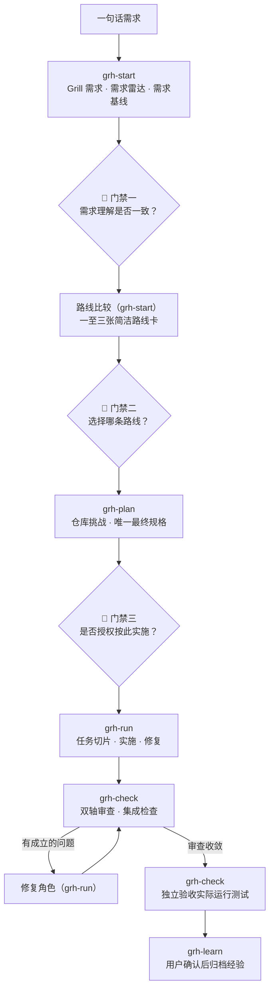

# Grill Harness

**人做决策，模型协作，高质量交付。**

一套装进 Codex 和 Claude Code 的软件工程工作流。复杂需求交给 AI，你只在三个关键节点拍板，其余由各有所长的模型接力完成；过程全部落在磁盘和证据上——会话再长、中途换模型、隔几天再来，都不丢事实。

```text
grh-start → grh-plan → grh-run → grh-check → grh-learn
 问透需求    收敛规格    切片实施    独立把关    沉淀经验
```

方法论内化自 [mattpocock/skills](https://github.com/mattpocock/skills)：先把需求问透，再让真实仓库挑战方案，最后用独立审查和真实测试收口。

---

## 为什么值得一试

AI 写代码不难，难的是它动手太早、交接丢约束、审查只信总结、没跑测试就说完成——最后兜底的还是你。Grill Harness 把这四个坑变成流程上的硬边界：

- **你只拍板三次。** 需求是不是这个意思、走哪条路线、规格能不能开工，模型到这三处必须停下等你；规格批准前，你的仓库保持只读。
- 这里的“三次”指单个工作流一轮需求的主线确认；需求变更、多仓拆分与高风险取舍会按变更追加确认，且每次批准都绑定当时的真实产物版本。
- **查得到的不来烦你。** 仓库和文档里有答案的事实，模型自己查证；拿到你面前的只有真正的产品取舍，一次一个问题，附推荐答案。
- **换模型像换班，不像失忆。** 每个角色读磁盘上一份自包含任务包：分析用擅长分析的模型，实施用执行稳的，审查用眼尖的，交接零损耗。
- **“完成”是跑出来的，不是说出来的。** 审查读完整 diff 而不是实施者的总结，验收在新会话里真的运行测试；没有命令、退出码和输出，谁也不能交差。

一句话：你从上下文搬运工，变回决策者和验收人。Harness 负责流程和产物，模型在授权范围内干活，你负责拍板和收货。

---

## 三次拍板，都用在刀刃上

| 门禁 | 你回答的问题 | 点头之后 |
|---|---|---|
| 需求基线 | 我们理解的是不是同一个需求？ | 开始比较可行路线 |
| 路线选择 | 这几条可行路线里，我选哪一条？ | 只深化你选中的那条 |
| 规格批准 | 这份实施合同能不能授权写代码？ | 拆分任务，进入实施 |

三道门禁不会被打包成一次确认，也不会被预批或省略，轻量模式也一样。你批的永远是当时真实形成的产物，答复原文都会存档，随时可查。

---

## 一句话需求怎么走完全程

> 给订单提交增加幂等能力，避免重复创建订单。

直接丢给一个模型，多半是在同步接口加个判断就收工，漏掉异步重试、并发竞争、幂等键生命周期。在 Grill Harness 里，它是一场只需要你点三次头的接力：



每个入口做完自己声明的范围就停。继续、换模型、缩小范围还是先放一放，都由你说了算。

<details>
<summary>展开看每一棒的交接细节</summary>

| 接力棒 | 谁来做 | 发生了什么 |
|---|---|---|
| 问透需求（`grh-start`） | 你选的分析型模型 | 查清调用方、重复请求的定义、失败重试语义和回滚要求 |
| 🙋 门禁一 | 你 | 确认幂等范围、保留时间和冲突时的返回行为 |
| 路线比较（`grh-start`） | 同一角色 | 数据库唯一约束、幂等记录表、外部服务，各一张路线卡 |
| 🙋 门禁二 | 你 | 拍板一条路线；未选路线只存档，不再深化 |
| 仓库挑战（`grh-plan`） | 你选的长上下文模型 | 发现同步与异步重试共用创建逻辑，找到事务和测试切入点 |
| 最终规格（`grh-plan`） | 最终方案角色 | 数据模型、接口行为、错误语义、迁移和验收标准收敛为一份 |
| 🙋 门禁三 | 你 | 批准这份实施合同，产品仓库这才解除只读 |
| 切片实施（`grh-run`） | 你选的执行型模型 | 逐切片完成存储、同步路径、异步路径和测试，附命令证据 |
| 独立审查（`grh-check`） | 新会话的审查模型 | 对完整 diff 检查并发、超时、兼容性和非目标 |
| 独立验收（`grh-check`） | 又一个新会话 | 实际运行单元、集成和重复请求测试后给出交付结论 |
| 经验归档（`grh-learn`） | 经你确认 | 沉淀关键决策、踩坑和证据链接 |

每一棒读的都是磁盘上的任务包，不是上一位的聊天记录，所以任何一棒都可以换模型、换会话，甚至隔几天再继续。

</details>

---

## 质量从哪里来

不靠某个模型更自信的总结，靠几层互不隶属的把关：

- **需求雷达**先把澄清、遗漏、牵连、悖论、相似实现五类风险问在前面；
- **仓库挑战**用真实文件、调用链和测试去反驳方案，而不是顺着方案想象代码；
- **独立审查**在新会话里读完整 diff，代码规范一条轴、规格实现一条轴，互不遮掩；
- **独立验收**再开一个新会话，重新理解目标、实际运行测试，才给交付结论。

实施者不能给自己验收，审查不采信任何人的总结。每个角色只拿到一份写清目标、授权范围、禁区和停止条件的任务包，用哪个模型演哪个角色由你定，完整契约见[角色任务协议](skills/grill-harness/references/角色任务协议.md)。

<details>
<summary>需求雷达具体在替你问什么？</summary>

需求雷达不要求你懂工程分类，它把五类风险翻译成五个日常问题：

| 雷达维度 | 你真正关心的问题 | Agent 负责查证的内容 |
|---|---|---|
| 需求澄清 | 到底是谁，在什么条件下，要得到什么结果？ | 角色、触发条件、目标、边界和歧义 |
| 需求遗漏 | 正常路径之外，还有哪些情况必须处理？ | 异常、权限、空状态、兼容、迁移、回滚和验收 |
| 需求牵连 | 改动会沿哪些调用方、数据和系统边界传播？ | 接口、状态、事件、配置、部署和文档 |
| 需求悖论 | 目标、约束、成本、期限和验收能否同时成立？ | 隐含取舍、冲突和阻塞条件 |
| 相似实现 | 仓库里有哪些先例，哪些能复用、哪些必须隔离？ | 真实路径、公共契约、可复用测试和历史踩坑 |

只有产品取舍、风险容忍和无法安全推导的冲突才会来找你，而且一次只问一个、每个问题都带推荐答案，不会甩你一张问卷；每次问答的原文都会存进用户确认记录。

</details>

---

## 小事轻着走，大事走全程

| 模式 | 适用 | 怎么走 |
|---|---|---|
| **轻量** | 局部 Bug、配置、小范围修改 | 文档从简，但三次拍板、真实测试和独立验收一个不少 |
| **标准** | 跨模块功能、有技术取舍的需求 | 完整走需求 → 路线 → 规格 → 实施 → 审查 → 验收 |
| **Wayfinding** | 大到一个会话看不清的工作 | 先拆独立调查任务摸清方向，再回到标准流程 |

也有不需要它的时候：解释一段代码、做次临时探索，或者需求和边界都已清楚的小事，直接聊更快。

---

## 八个入口，记住一条主线就行

主线就是开头那五步；另外三个入口做辅助。不确定下一步时，问 `grill-harness`，它会告诉你现在在哪、接着去哪。

| 入口 | 拿来做什么 | 停止边界 |
|---|---|---|
| `grh-start` | Grill 需求、需求基线、路线比较 | 你选完路线就停 |
| `grh-plan` | 研究/原型、仓库挑战、最终规格、任务拆分 | 规格批准后生成任务图就停 |
| `grh-run` | 任务包、实施、经批准的修复 | 不碰最终验收；路线失效转恢复 |
| `grh-check` | 独立审查、集成检查、最终验收 | 只凭真实仓库和证据下结论 |
| `grh-learn` | 查经验、复盘、知识归档 | 写入长期知识前等你确认 |
| `grill-harness` | 查状态、推荐下一步入口 | 只导航，不执行阶段 |
| `grh-recover` | 中断、漂移、冲突、重复失败 | 改路线前等你确认 |
| `grh-upstream-check` | 依赖与上游兼容检查 | 只读，不安装、不更新 |

你点名某个入口、或者只要更小的范围，都会照办；但三道门禁在哪条路上都绕不过去。

---

## 快速开始

只需要 Node.js（能跑 `npx`）和 Python 3（只用标准库）。两条命令装完，不用克隆本仓库：

```bash
# 1. 三个底层必需能力（来自 mattpocock/skills）
npx skills add mattpocock/skills -g -a codex claude-code -s grilling domain-modeling codebase-design -y --copy

# 2. Grill Harness 全部八个入口
npx skills add adi0754/grill-harness -g -a codex claude-code -s '*' -y --copy
```

`research`、`tdd`、`code-review` 等都是可选增强，缺了不影响主流程，也不会被自动安装（见[能力编排矩阵](skills/grill-harness/references/能力编排矩阵.md)）。只装部分入口也不要紧：缺少主内核时会提示你补齐，而不是带病运行。

装好后，对着你的项目说一句：

> 使用 `grh-start` 分析这个需求。先读取真实仓库并 Grill 需求，不要提前修改代码。

<details>
<summary>卸载</summary>

卸载不会删除你已有的工作流数据：

```bash
npx skills remove grill-harness grh-start grh-plan grh-run grh-check grh-recover grh-learn grh-upstream-check -g -a codex claude-code -y
```

</details>

---

## 边界，白纸黑字

- 所有状态、任务包和报告只写入 `~/.grill-harness/`，你的产品仓库里不落一个 Harness 文件；
- 最终规格批准前，产品仓库只读；
- 事实存在磁盘上：中断、换模型、换会话后原地恢复，不靠回忆聊天；
- 同一个问题第三次修不动，会停下来走 `grh-recover`，不会无休止硬修；
- 经验先形成草稿、经你确认才写入项目知识，晋升为通用知识还要第二次独立批准；
- 预检和上游检查只读：不安装、不更新任何第三方 Skill，缺必需能力时直接停下说明；拿不准能否并行时，一律按串行处理。

这些边界不是口头承诺：入口发现、隔离安装、只读边界、状态对账、恢复链、卸载保留数据，都有确定性测试盯着，一条 `python3 -m unittest discover -s tests -p 'test_*.py'` 就能复现。也坦白说：真实模型的端到端执行还缺在线证据（隔离环境里 Codex 和 Claude Code 均未登录），这部分如实标注为未验证。

完整契约：[阶段执行协议](skills/grill-harness/references/阶段执行协议.md) · [文档与产物契约](skills/grill-harness/references/文档与产物契约.md) · [工作流状态机](skills/grill-harness/references/工作流状态机.md) · [Claude Code 运行时](skills/grill-harness/references/Claude-Code运行时.md) · [Codex 运行时](skills/grill-harness/references/Codex运行时.md)

---

**让不同模型各展所长，让每一次交付都由人确认、由证据负责。**

许可证：MIT，见 [LICENSE](LICENSE)。
